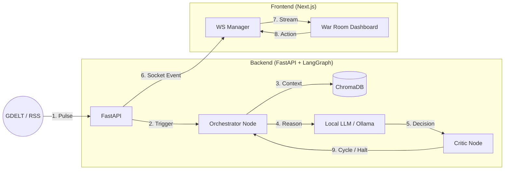

# Project EMERGENCE: Technical Architecture

This document provides a high-level overview of the system design, tech stack, and data flow for the Project EMERGENCE geopolitical simulation.

## 1. Core Tech Stack

| Component | Technology | Role |
| :--- | :--- | :--- |
| **Frontend** | **Next.js (React)** | Dashboard, real-time message rendering, and UI states. |
| **Backend** | **FastAPI (Python)** | WebSocket management, agent orchestration, and API endpoints. |
| **Logic Engine**| **LangGraph** | Cyclic state machine for multi-agent debate coordination. |
| **LLM Inference**| **Ollama** | Local LLM execution (Llama 3, Mistral, etc.) for agent reasoning. |
| **Vector DB** | **ChromaDB** | Long-term memory storage and RAG (Retrieval-Augmented Generation). |
| **Real-time** | **WebSockets** | Low-latency bi-directional streaming of simulation events. |
| **Styling** | **Tailwind CSS** | Premium dashboard aesthetics and responsive layout. |

## 2. Horizontal System Flow

The simulation follows a cyclic "Blackboard" architecture where agents react to a shared state rather than following a linear turn order.

## 3. Data Architecture

### A. Episodic Memory (Short-Term)
*   **Blackboard State**: Stores the current session messages, global tension levels, and actor relevance scores in memory during the graph execution.

### B. Historical Memory (Long-Term)
*   **RAG Engine**: When a speaker is selected, the system queries **ChromaDB** for real-world historical precedents related to the current news headline. These are injected into the LLM system prompt.

### C. Agent DNA
*   **Static Profiles**: JSON definitions of each country's "Personality", "Hidden Agenda", and "Red Lines" (trigger conditions).

## 4. Communication Protocol

We use a standard JSON event-based protocol over WebSockets:
*   `type: headline`: Initiates the simulation with a news topic.
*   `type: agent_thinking`: Shows the internal reasoning "behind the scenes."
*   `type: agent_speaking`: Streams the actual diplomatic statement.
*   `type: debate_end`: Triggers the After-Action Report (AAR).
